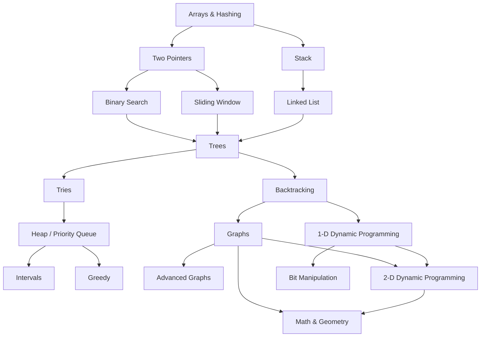

# LeetCode Journey

Welcome to **LeetCode Journey**! This repository contains solutions to LeetCode problems, implemented in Python, C#, and Java. The problems are organized based on the data structure and algorithm categories, following the [NeetCode Roadmap](https://neetcode.io/roadmap) — progressing from foundational concepts like arrays and hashing to advanced techniques like dynamic programming and graph theory.

The goal isn't just to solve problems, but to build **intuition** for recognizing patterns and choosing the right approach.

## Roadmap Overview

| Index | Category                     | Description |
|:-----:|------------------------------|-------------|
| **1** | **Arrays & Hashing**         | Problems related to arrays and hashing techniques |
| **2.1** | **Two Pointers**          | Problems using the two-pointer technique |
| **2.2** | **Stack**                 | Stack-based problems |
| **3.1** | **Binary Search**         | Binary search algorithms |
| **3.2** | **Sliding Window**        | Subarray and substring optimization |
| **3.3** | **Linked List**           | Linked list operations and traversal |
| **4** | **Trees**                   | Binary trees, BSTs, DFS, BFS |
| **5.1** | **Tries**                 | Prefix tree and string lookup |
| **5.2** | **Backtracking**          | Recursive exploration problems |
| **6.1** | **Heap / Priority Queue** | Top-K, scheduling, median problems |
| **6.2** | **Graphs**                | Graph traversal and representation |
| **6.3** | **1-D Dynamic Programming** | Linear DP problems |
| **7.1** | **Intervals**             | Overlapping intervals and scheduling |
| **7.2** | **Greedy**                | Locally optimal decision-making |
| **7.3** | **Advanced Graphs**       | Complex graph algorithms |
| **7.4** | **2-D Dynamic Programming** | Grid-based DP |
| **7.5** | **Bit Manipulation**      | Bitwise operations |
| **8** | **Math & Geometry**         | Mathematical and geometry problems |

## How to Use
1. Follow the roadmap **top to bottom** — each topic builds on the previous ones.
2. Navigate to a topic folder to find solutions organized by problem.
3. Each solution includes time/space complexity analysis.
