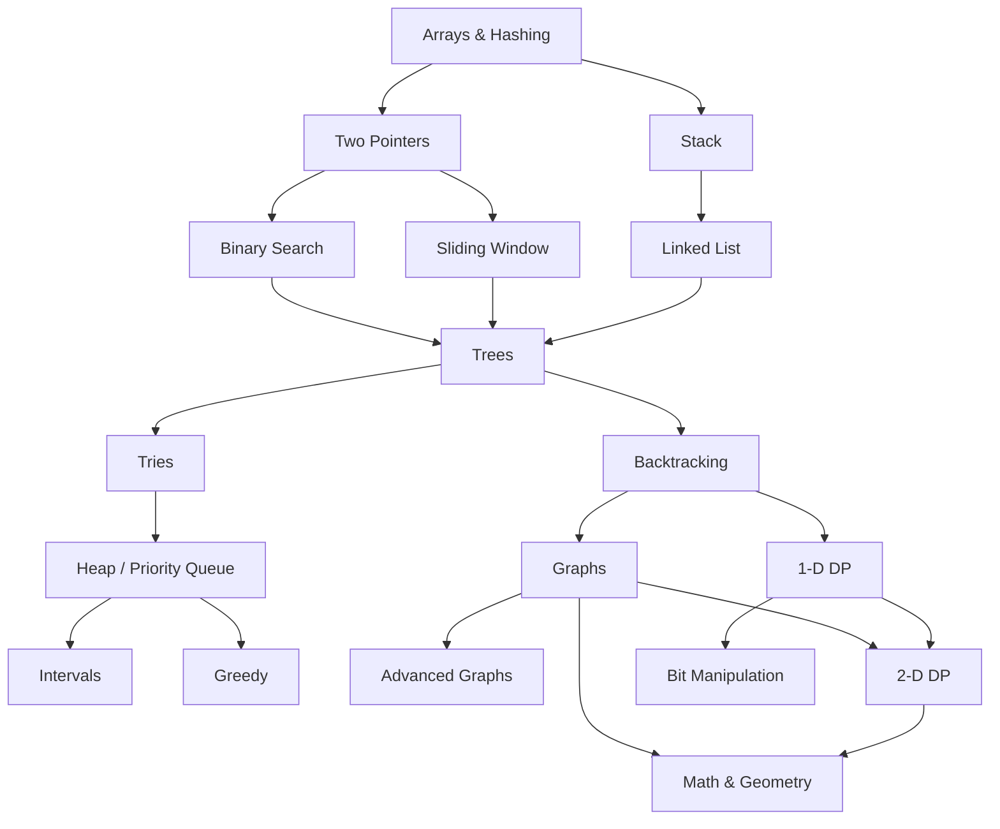

# LeetCode Journey

Welcome to **LeetCode Journey**! This repository contains solutions to LeetCode problems. The problems are organized based on the data structure and algorithm categories, following the [NeetCode Roadmap](https://neetcode.io/roadmap) — progressing from foundational concepts like arrays and hashing to advanced techniques like dynamic programming and graph theory.

The goal isn't just to solve problems, but to build **intuition** for recognizing patterns and choosing the right approach.

## Roadmap Overview

- **1. Arrays & Hashing** — Problems related to arrays and hashing techniques.
- **2.1. Two Pointers** — Problems that can be solved using the two-pointer technique.
- **2.2. Stack** — Problems focused on stack data structure.
- **3.1. Binary Search** — Problems that involve binary search algorithms.
- **3.2. Sliding Window** — Problems solved using sliding window approach.
- **3.3. Linked List** — Problems based on linked lists.
- **4. Trees** — Tree-related problems including binary trees, BSTs, and traversal techniques (DFS, BFS).
- **5.1. Tries** — Prefix tree problems for efficient string searching, autocomplete, and word validation.
- **5.2. Backtracking** — Backtracking problems.
- **6.1. Heap / Priority Queue** — Using min/max heaps for top-K elements, median finding, and task scheduling.
- **6.2. Graphs** — Basic graph algorithms.
- **6.3. 1-D DP** — 1-D Dynamic Programming problems.
- **7.1. Intervals** — Problems involving merging, inserting, and scheduling overlapping intervals.
- **7.2. Greedy** — Problems where locally optimal choices at each step lead to a globally optimal solution.
- **7.3. Advanced Graphs** — Advanced graph algorithms.
- **7.4. 2-D DP** — 2-D Dynamic Programming problems.
- **7.5. Bit Manipulation** — Problems involving bit manipulation.
- **8. Math & Geometry** — Mathematical and geometry-based problems.

## How to Use
1. Follow the roadmap **top to bottom** — each topic builds on the previous ones.
2. Navigate to a topic folder to find solutions organized by problem.
3. Each solution includes time/space complexity analysis.
